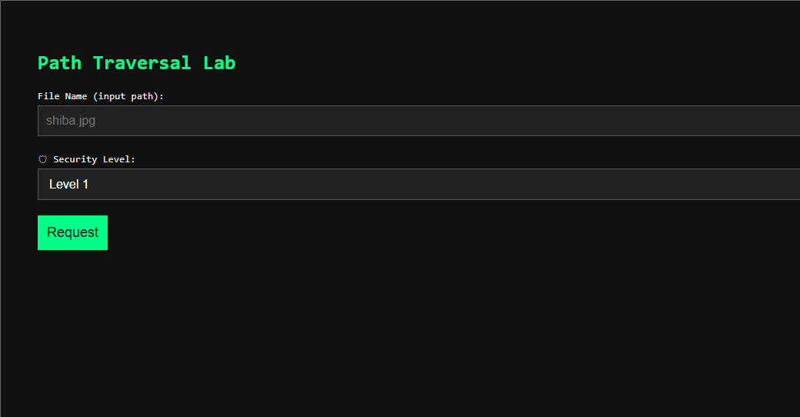
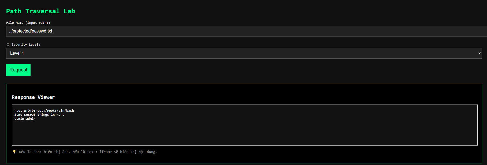
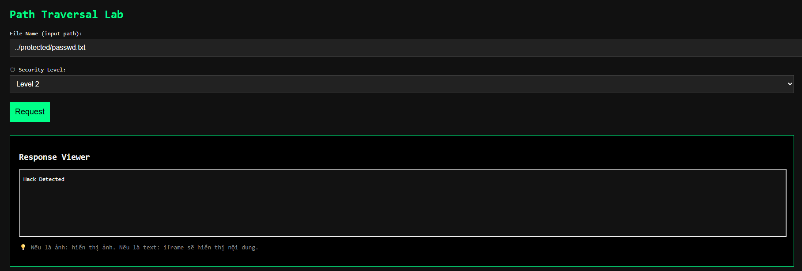

# Java Servlet Path Traversal by Phat

### Tổng quan cấu trúc file java

```text
+---.idea
+---.mvn
ª   +---wrapper
+---src
ª   +---main
ª   ª   +---java
ª   ª   ª   +---com
ª   ª   ª       +---example
ª   ª   ª           +---path_traversal
ª   ª   +---resources
ª   ª   ª   +---META-INF
ª   ª   +---webapp
ª   ª       +---images
ª   ª       +---WEB-INF
ª   +---test
ª       +---java
ª       +---resources
+---target
    +---classes
    ª   +---com
    ª   ª   +---example
    ª   ª       +---path_traversal
    ª   +---META-INF
    +---generated-sources
    ª   +---annotations
    +---Path_Traversal-1.0-SNAPSHOT
        +---images
        +---META-INF
        +---WEB-INF
            +---classes
                +---com
                ª   +---example
                ª       +---path_traversal
                +---META-INF
```

### Source Code


### Tổng quan về ứng dụng



Challenge được chia thành 4 levels với các lớp phòng thủ khác nhau việc của ta là khai thác được file passwd.txt được giấu ở /protected/.


Test thử chức năng bằng cách nhập tên hình ảnh đã được lưu vào folder /images/ và thành công hiển thị ảnh.

### Tiến hành POC các levels
#### Level 1:

```java
private void handleLevel1(String fileName, HttpServletResponse response) throws IOException {
        String fullPath = "images/" + fileName;
        InputStream in = fileModel.getFileStreamUnsafe(fullPath);

        if (in == null) {
            response.setStatus(HttpServletResponse.SC_NOT_FOUND);
            response.getWriter().println("File not found: " + fullPath);
            return;
        }

        System.out.println("[Level 1] Requesting file: " + fullPath);
        response.setContentType(fileModel.getMimeType(fileName));

        try (OutputStream out = response.getOutputStream()) {
            byte[] buffer = new byte[1024];
            int bytesRead;
            while ((bytesRead = in.read(buffer)) != -1) {
                out.write(buffer, 0, bytesRead);
            }
        }
    }
```

Ta có thể thấy ở level 1 không hề có 1 lớp filter nào nó chỉ đơn giản là xử lý logic để đọc file lấy thông tin file để thực hiện in file ra, ở đây mình sẽ dùng relative path để tiến hành khai thác để truy cập vào file bí mật.



Với payload `../protected/passwd.txt` ta đã có thể lùi về thư mục cha mà mình đang đứng chính là thư mục `/images` và mở file passwd.txt ở trong folder `/protected`.

#### Level 2:

```java 
private void handleLevel2(String fileName, HttpServletResponse response) throws IOException {
        if (fileName.contains("..")) {
            response.getWriter().println("Hack Detected");
            return;
        }
        viewFile(fileName, response);
    }
```

Ở level này có thể thấy dấu `..` đã bị chặn đứng vậy liệu có cách nào để ta trỏ đến thư mục khác mà không cần phải sử dụng đến dấu `..` không?
Như đã nói cách trên lv1 là sử dụng relative path ngoài ra còn có 1 cái nữa được gọi là absolute path đó là gọi thẳng tới đúng chuẩn thư mục, cách này sẽ thành công nếu ta biết rõ nơi chúng ta cần trỏ tới.



Có thể thấy lớp filter hoạt động bình thường và chặn dấu thành công nhưng trường hợp bây giờ khá là dở vì app được host trên windows nên sẽ không có dùng được absolute path vậy nên ta sẽ phải dùng cách khác.


