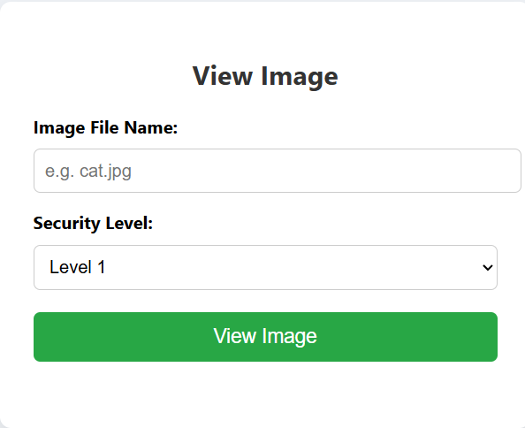
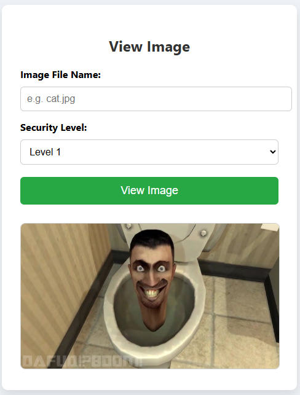
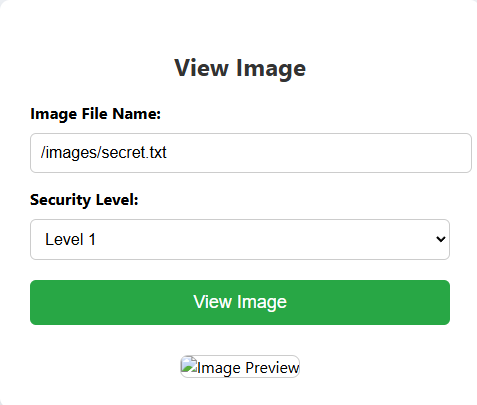

# Java Servlet Path Traversal by Phat

### Tổng quan cấu trúc file java

```text
+---.idea
+---.mvn
ª   +---wrapper
+---src
ª   +---main
ª   ª   +---java
ª   ª   ª   +---com
ª   ª   ª       +---example
ª   ª   ª           +---path_traversal
ª   ª   +---resources
ª   ª   ª   +---META-INF
ª   ª   +---webapp
ª   ª       +---images
ª   ª       +---WEB-INF
ª   +---test
ª       +---java
ª       +---resources
+---target
    +---classes
    ª   +---com
    ª   ª   +---example
    ª   ª       +---path_traversal
    ª   +---META-INF
    +---generated-sources
    ª   +---annotations
    +---Path_Traversal-1.0-SNAPSHOT
        +---images
        +---META-INF
        +---WEB-INF
            +---classes
                +---com
                ª   +---example
                ª       +---path_traversal
                +---META-INF
```
Cấu trúc project sẽ bao gồm 2 file Java chính với `FileModel.java` sẽ xử lý phần check File Directory và `FileViewServlet` sẽ xử lý logic và chức năng download ảnh từ thư viện ảnh cho sẵn và ở đây với cách lớp filter khác nhau ta sẽ chia ra làm 4 challenges.



### Source Code


### Tổng quan về ứng dụng
Đây là một app có chức năng preview các image cho sẵn chỉ cần nhập tên thì tự động ảnh sẽ hiện lên cho ta.



Ở đây tôi nhập tên 1 ảnh và bấm sau đó thì nó đã được hiện ra.

### Tiến hành POC các levels
#### Level 1:

```java
 private void handleLevel1(String fileName, HttpServletResponse response) throws IOException {
        Path resolvedPath = Path.of(FileModel.BASE_DIRECTORY, fileName).normalize();
        System.out.println("[Level 1] Resolved path: " + resolvedPath.toAbsolutePath());

        if (!fileModel.fileExists(fileName)) {
            response.setStatus(HttpServletResponse.SC_NOT_FOUND);
            response.getWriter().println("File not found.");
            return;
        }

        response.setContentType(fileModel.getMimeType(fileName));

        try (InputStream in = fileModel.getFileStreamUnsafe(fileName);
             OutputStream out = response.getOutputStream()) {

            byte[] buffer = new byte[1024];
            int bytesRead;
            while ((bytesRead = in.read(buffer)) != -1) {
                out.write(buffer, 0, bytesRead);
            }

        } catch (IOException e) {
            response.setStatus(HttpServletResponse.SC_INTERNAL_SERVER_ERROR);
            response.getWriter().println("Error reading file.");
        }
    }
    }
```
Ở level 1 ta có thể thấy phần xử lý logic của file chỉ có kiểm tra sự tồn tại của file và không có lớp phòng thủ nào vậy nên hoàn toàn ta có thể sử dụng cách tấn công bình thường nhất để khai thác path traversal. Ở trong bài tôi đã giấu 1 file secret.txt nằm trong hệ thống vậy liệu ta sẽ đọc nó như thế nào.
Ở đây tôi sẽ dùng payload `../secret.txt` payload này sẽ cho ta lùi 1 thư mục đến thư mục cha của thư mục hiện tại của ta.


Sau khi bấm load ảnh mới trên new page thì ta có được thông tin của file bí mật vừa rồi.

#### Level 2:
Đến với level 2 ở level này thì dấu `..` đã bị filter nên ta sẽ phải tìm đường khác để khai thác path traversal.

```java
   private void handleLevel2(String fileName, HttpServletResponse response) throws IOException {
        if (fileName.contains("..")) {
            response.getWriter().println("Hack Detected");
            return;
        }
        viewFile(fileName, response);
    }
```

Ở level 1 ta đã sử dụng `..` để thực hiện quay về thư mục cha của thư mục hiện tại và nó được gọi là relative path nhưng ở đây dấu `..` đã dính filter nên ta có thể sử dụng cách khác là dùng absolute path để trỏ đến file bí mật.


Sử dụng đã bị dính hack detected.



Tiến hành sử dụng absolute path.


